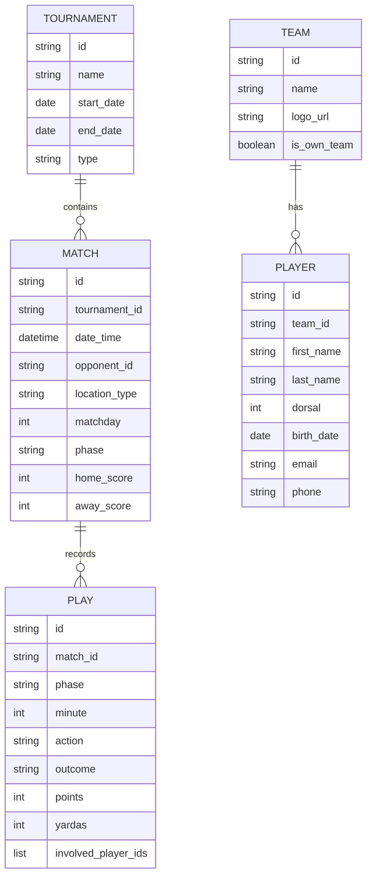
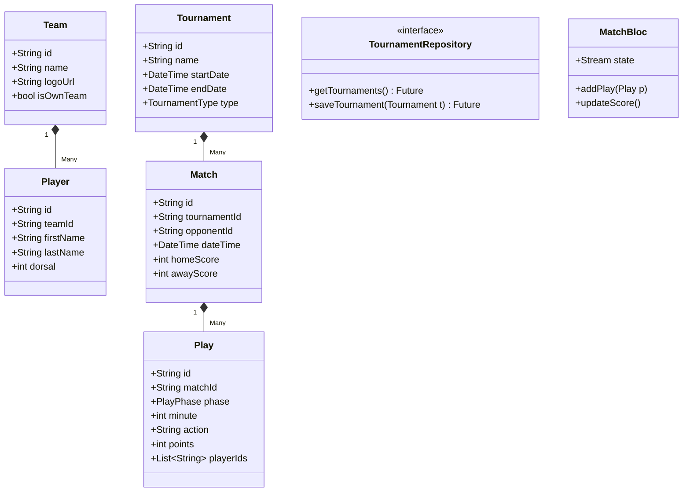

## 1. Use Case Diagram
All interactions are managed through the Flutter application by the team's manager/coach.

```mermaid
useCaseDiagram
    actor "Manager / Coach" as user
    package "Team Management" {
        usecase "Manage Tournaments" as UC1
        usecase "Manage Teams & Players" as UC2
    }
    package "Match Recording (Real-time)" {
        usecase "Initialize Match" as UC3
        usecase "Record Play (Ataque/Defensa/Extra)" as UC4
        usecase "Real-time Scoreboard & Highlights" as UC5
    }
    package "Analytics" {
        usecase "Consult Stats" as UC6
    }
    user --> UC1
    user --> UC2
    user --> UC3
    user --> UC4
    user --> UC5
    user --> UC6
```

## 2. Data Model (ERD) - Firebase Firestore
The application will use Firebase Firestore as the primary database.



## 3. Class Diagram (Data & Domain)



## 4. App Architecture
The app follows **Clean Architecture** principles to ensure maintainability and testability.

### 4.1 Layers
- **Core**: Common utilities, themes, constants.
- **Data Layer**: Repositories, Data Sources (Firebase), Models (JSON serialization).
- **Domain Layer**: Entities, Use Cases (Business logic).
- **Presentation Layer**: Widgets, Blocs/Providers (State Management), Pages.

### 4.2 State Management
- **Flutter BLoC**: For complex state management (Match Recording, Multi-layer stats).
- **Provider/Riverpod**: For simple state (Authentication, User profile).

## 5. UI/UX Style (NFL Aesthetic)
- **Primary Color**: Deep Blue (`#013369`) / Neutral Dark Grey (`#121212`).
- **Accent Color**: NFL Gold (`#D50A0A`) or White for high contrast.
- **Typography**: Bold, condensed sans-serif (e.g., *Roboto Condensed* or *Inter*).
- **Components**: Glassmorphism highlights, smooth transitions between play phases.

## 6. Maintenance Policy
As defined in [AGENTS.md](file:///d:/projects/tagfootstats/tagfootstats/AGENTS.md), these diagrams MUST be updated whenever the core data structure or logic changes. AI agents are responsible for ensuring zero drift between diagrams and code.
